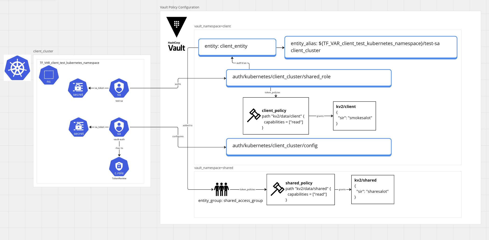

# vault.k8s.sharedsecrets

## Architecture


## Setup
- Call outs on what this will not do:
  - install a vault
  - setup vault csi/vso/webhook-injector
- You're going to need the following binaries installed:
  - base64
  - go-task
  - helm
  - jq
  - kubectl
  - terraform
  - vault
  - yq
```bash
# create .env file - to be read by go-task
cat <<EOF > .env
export VAULT_ADDR=...
export VAULT_FORMAT=json
export CLIENT_KUBECONFIG=... # full path to kubeconfig
export TF_VAR_client_test_kubernetes_namespace=...
export IMAGE=... # threaded through to helm
EOF
```
- `task tf_apply` - sets up vault policy against VAULT_ADDR, using the currently configured token. Tested with a naughty ROOT_TOKEN.
- `task auth_apply` - configures kubernetes auth against VAULT_ADDR, using the CLIENT_KUBECONFIG  into the ${TF_VAR_client_test_kubernetes_namespace}
- `task tests_apply` - deploys the tests mentioned below into the ${TF_VAR_client_test_kubernetes_namespace}

## Results
### Agent Injector Shared Secrets
| Deployment Name        | vault.hashicorp.com/namespace | Secret Path                                   | Res Namespace | Res Url                                                                 | Error/Notes                                                                                                             | 
| --                     | --                            | --                                            | --            | --                                                                      | --                                                                                                                      | 
| ss-using-token-webhook | client                        | client=kv2/data/client                        | client/       |                                                                         | Success - uses 2 step with vault.hashicorp.com/agent-inject-token: "true" to send req to shared/ vault ns               | 
| ss-webhook-fail1       | client                        | client=kv2/data/client,shared=kv2/data/shared | client/       | GET ${VAULT_ADDR}/v1/kv2/data/shared                                    | permission denied                                                                                                       | 
| ss-webhook-fail2       | shared                        | shared=kv2/data/shared                        | shared/       | PUT ${VAULT_ADDR}/v1/auth/kubernetes/client_cluster/login               | permission denied                                                                                                       | 
| ss-webhook-fail3       | client                        | shared=shared/kv2/data/shared                 | shared/       | URL: GET ${VAULT_ADDR}/v1/sys/internal/ui/mounts/shared/kv2/data/shared | preflight capability check returned 403, please ensure client's policies grant access to path "shared/kv2/data/shared/" | 
| ss-webhook-fail4       | client                        | shared=/shared/kv2/data/shared                | shared/       | URL: GET ${VAULT_ADDR}/v1/sys/internal/ui/mounts/shared/kv2/data/shared | preflight capability check returned 403, please ensure client's policies grant access to path "shared/kv2/data/shared/" | 
| ss-webhook-fail5       | /                             | shared=/shared/kv2/data/shared                | n/a           | vault.hashicorp.com/auth-path=/client/auth/kubernetes/client_cluster    | agent.auth.handler: authentication returned nil auth info: backoff=1s                                                   | 
### CSI Provider Shared Secrets
| Deployment Name | vaultNamespace | Secret Path                                                                                  | Res Namespace | Res Url                                                    | Error/Notes                                                                                                                                        | 
| --              | --             | --                                                                                           | --            | --                                                         | --                                                                                                                                                 | 
| ss-csi-fail1    | client         | shared=kv2/data/shared                                                                       | client/       | GET ${VAULT_ADDR}/v1/kv2/data/shared                       | * permission denied                                                                                                                                | 
| ss-csi-fail2    | shared         | shared=kv2/data/shared                                                                       | shared/       | POST ${VAULT_ADDR}/v1/auth/kubernetes/client_cluster/login | * permission denied                                                                                                                                | 
| ss-csi-fail3    | client         | shared=shared/kv2/data/shared                                                                | client/       | GET ${VAULT_ADDR}/v1/shared/kv2/data/shared                | * permission denied                                                                                                                                | 
| ss-csi-fail4    | /              | shared=shared/kv2/data/shared,vaultKubernetesMountPath=client/auth/kubernetes/client_cluster |               |                                                            | Crashloop on vault provider nil pointer dereference https://github.com/hashicorp/vault-csi-provider/blob/v1.2.1/internal/provider/provider.go#L102 | 
- note cannot access 'client' namespace: ```req := client.NewRequest(http.MethodPost, "/v1/auth/"+params.VaultKubernetesMountPath+"/login")```
- tested with hashicorp/vault-csi-provider:1.2.1, registry.k8s.io/csi-secrets-store/driver:v1.3.1
### VSO Shared Secrets
| VaultStaticSecret | vault_namespace | auth_mount                            | secret_mount | path   | res_ns | res_url                                                               | error             | 
| --                | --              | --                                    | --           | --     | --     | --                                                                    | --                | 
| fail1             | client          | kubernetes/client_cluster             | kv2          | shared | client | GET ${VAULT_ADDR}/v1/kv2/data/shared                                  | permission denied | 
| fail2             | client          | kubernetes/client_cluster             | shared/kv2   | shared | client | GET ${VAULT_ADDR}/v1/shared/kv2/data/shared                           | permission denied | 
| fail3             | ''              | client/auth/kubernetes/client_cluster | shared/kv2   | shared | client | PUT ${VAULT_ADDR}/v1/auth/client/auth/kubernetes/client_cluster/login | permission denied | 
- vso prepends 'auth' to the VaultAuth `mount`
## Versions Tested
- vault: 1.13.4-ent
- vault-csi-provider: 1.2.1
- vault-secrets-operator: 0.4.3
- vault-k8s: 1.2.0
